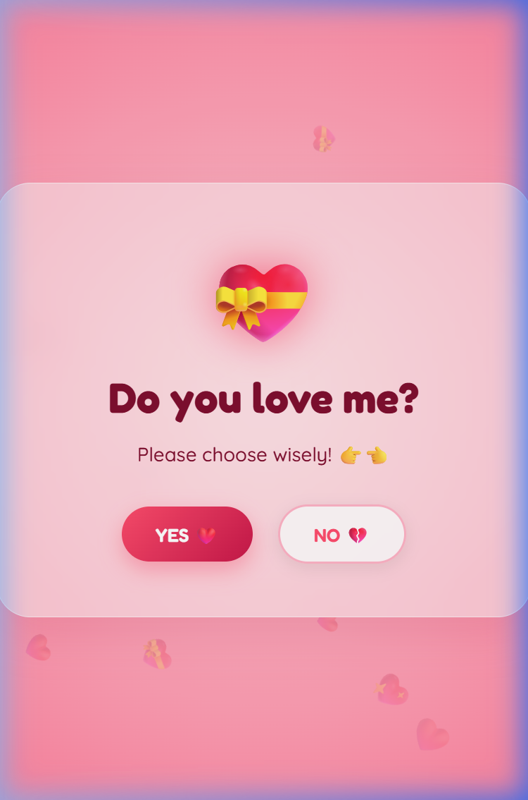
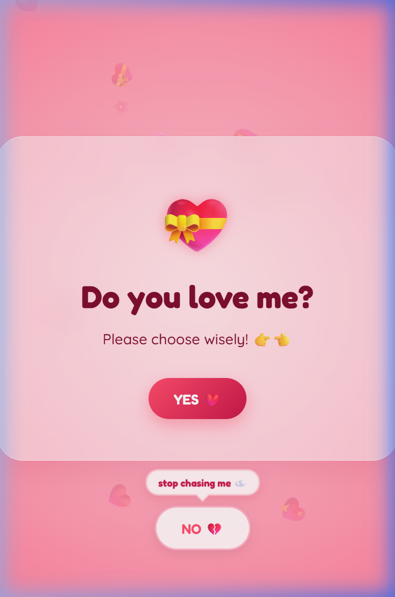
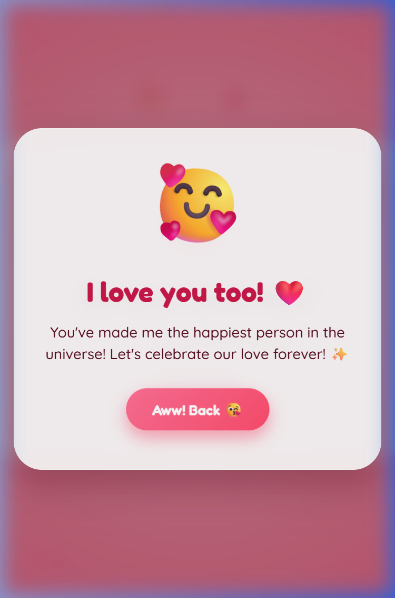
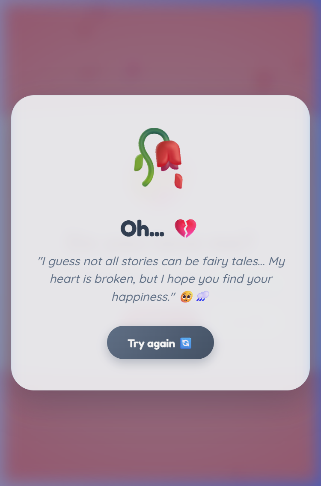

# Interactive Proposal & Love Confession App 💖

A high-fidelity, visually stunning, and highly interactive single-page React web application built on **Vite + React 19**. The app features a playful, gamified valentine-style experience where the user is presented with a proposal card containing two buttons: **"YES ❤️"** and **"NO 💔"**. 

While the **"YES ❤️"** button leads to a celebratory confirmation modal, the **"NO 💔"** button dynamically evades the user's cursor or touch points, triggering unique stage warnings before eventually yielding.

---

## 📸 Application Screenshots

### 1. Main Proposal Card
The main screen features custom floating background heart animations, a pastel pink radial gradient, and a glassmorphic proposal card centered in the viewport.


### 2. Warning Speech Bubble (5 Escapes)
After chasing the button 5 times, a speech bubble appears prompting the user to stop chasing.


### 3. Celebration Modal (YES Clicked)
Clicking YES brings up a celebration popup overlay styled with a pulsing emoji and floating heart particle layers.


### 4. Sad Rejection Modal (NO Clicked after 10 Escapes)
After 10 escapes, the button gets tired, stays still, and becomes clickable. Tapping it opens a blue/slate-themed modal displaying a sad quote.


---

## 🛠️ How It Works (Technical Implementation)

The project leverages standard React hooks, Web APIs, and custom CSS variables to deliver smooth, responsive interactions.

### 1. Viewport-Bounded Evasion Logic
* A mouse proximity listener tracks cursor coordinates (`clientX`/`clientY`) relative to the viewport.
* It calculates the Euclidean distance to the center coordinates of the **"NO 💔"** button.
* If the cursor gets within **130px**, a relocation trigger computes a random coordinate pair within the viewport.
* The algorithm enforces a safe edge margin (**40px**) and utilizes a proximity validation loop (up to 15 retries) to guarantee the button never teleports directly under the cursor or slips off-screen.

### 2. Evasion Cooldown Throttling
To prevent continuous triggers and double-ticks caused by micro-movements, a **450ms cooldown** throttle is managed using React's `useRef`:
```javascript
const now = Date.now();
if (now - lastRelocateTime.current < 450) return;
lastRelocateTime.current = now;
```
This guarantees that each chase gesture increments the count exactly once.

### 3. React Portal Containing Block Bypass
The main card `.confession-card` utilizes layout transitions and `backdrop-filter: blur(20px)` to create a premium glassmorphic feel. However, CSS filters and transforms create a new containing block for all children, locking `position: fixed` relative to the card instead of the viewport.
To circumvent this, we utilize a **React Portal** (`createPortal`) to lift the **"NO 💔"** button directly into `document.body` the instant it starts fleeing:
```javascript
{isFleeing ? createPortal(<button ...>NO 💔</button>, document.body) : <button ...>NO 💔</button>}
```
This frees coordinates calculations from parent layout offsets and maps them directly to viewport pixels.

### 4. Layout Stabilization (YES Button Locking)
When the **"NO 💔"** button escapes to `document.body`, it leaves the card's centered flexbox. To prevent the **"YES ❤️"** button from automatically sliding to the center of the card, we render an invisible layout placeholder div matching the exact dimensions of the button to preserve the grid flow:
```jsx
<div className="btn btn-no" style={{ visibility: 'hidden', pointerEvents: 'none' }}>NO 💔</div>
```

### 5. Mobile & Touch Screen Adaptations
* **Mobile Margins**: Uses CSS `calc(100% - 40px)` constraints to ensure a consistent `20px` spacing from viewport boundaries on portrait screens.
* **Proximity Threshold Scaling**: When screen widths drop below `500px`, the evasion distance threshold dynamically reduces to `110px` so that the button can easily find open space in tight mobile layouts.
* **Scroll & Gesture Override**: Applies `touch-action: none` to the button to prevent accidental zooming or scrolling gestures during rapid taps.
* **Touch Coordinates**: Refined coordinates lookup mapping via `changedTouches` to ensure instant and precise touch-start reaction.

---

## 🚀 Getting Started

### 📋 Prerequisites
* Node.js (v18+ recommended)
* npm (v9+)

### ⚙️ Installation
Clone or navigate to the project root and run:
```bash
npm install
```

### 🖥️ Development Server
Start the local Vite dev server:
```bash
npm run dev
```

### 📦 Production Build
Compile and bundle the production files in the `/dist` directory:
```bash
npm run build
```

---

## 🤝 Attribution & Collaboration
* **Concept & Design**: Directed and conceptualized by @saitejavadagam.
* **Development & Optimization**: Built in partnership with **Antigravity AI (Gemini)**.

